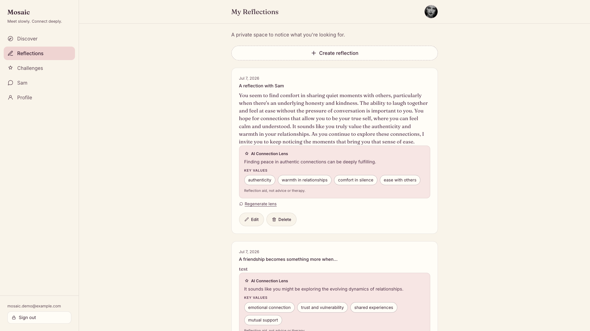
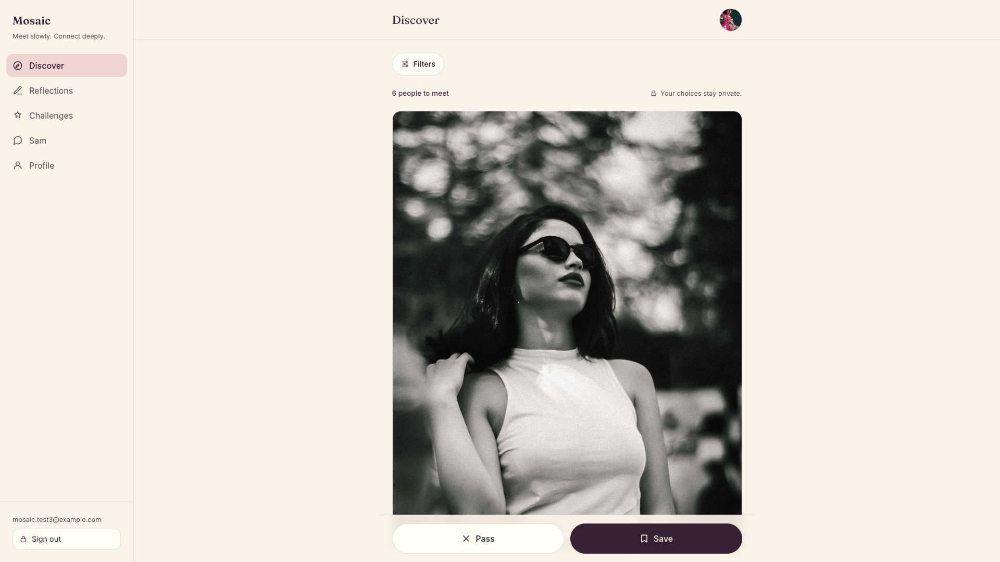
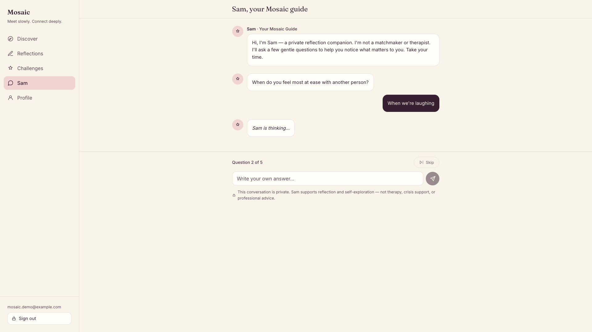
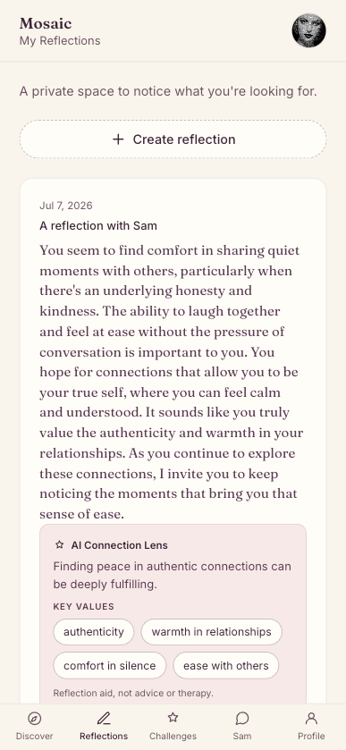

# Mosaic

Meet slowly. Connect deeply.

Mosaic is a values-first, friendship-first app for people who want to slow down before they connect. It gives you space to reflect on what matters to you, your values, your needs, and the kind of connection you are hoping for, so you can meet people with more clarity. Reflection comes first, and matching can follow.

## Live App

[Explore Mosaic](https://mosaic-blond.vercel.app)

## App Preview



<table>
  <tr>
    <td width="50%">
      
    </td>
    <td width="50%">
      
    </td>
  </tr>
</table>



## Why I Built This

Most dating apps push people to swipe and match as quickly as possible. Mosaic explores a slower path. It helps you notice your own values, needs, and patterns before you decide how to connect with anyone. The goal is not to replace your judgment. It is to support honest reflection and healthier connection.

## Core Features

- Secure sign up, sign in, and persistent sessions
- Profile creation, editing, and photo upload
- Private reflections with full create, read, update, and delete
- Discover with persistent Save and Pass decisions
- Challenges with full create, read, update, and delete
- Sam, an AI-guided reflection companion
- AI Connection Lens for saved reflections
- Responsive desktop and mobile experience
- Private user data protected with Supabase Auth, Row Level Security, and server-side AI calls

## How the AI Works

- Sam guides a short, gentle reflection conversation.
- Connection Lens turns a saved reflection into a clear theme and a few key values.
- All AI calls run through a Supabase Edge Function, never directly from the browser.
- Private user data stays protected with Supabase Auth and Row Level Security.
- OpenAI API keys are stored only in Supabase Edge Function Secrets.

## Tech Stack

| Layer | Tools |
| --- | --- |
| Frontend | React, TypeScript, Vite |
| Backend | Supabase, PostgreSQL, Row Level Security |
| Auth and Storage | Supabase Auth, Supabase Storage |
| AI | Supabase Edge Functions, OpenAI Chat Completions API |
| Deployment | Vercel |

## Important Links

- Live App: https://mosaic-blond.vercel.app
- GitHub Repository: https://github.com/thara-messeroux/mosaic
- React: https://react.dev
- Vite: https://vite.dev
- Supabase: https://supabase.com
- Supabase Row Level Security: https://supabase.com/docs/guides/database/postgres/row-level-security
- Supabase Edge Functions: https://supabase.com/docs/guides/functions
- OpenAI API: https://platform.openai.com/docs
- Vercel: https://vercel.com

## Local Setup

Install dependencies and run the app:

```
npm install
npm run dev
npm run build
```

Set these environment variables in a local `.env.local` file:

```
VITE_SUPABASE_URL
VITE_SUPABASE_ANON_KEY
```

`OPENAI_API_KEY` is not stored in the frontend. It belongs only in Supabase Edge Function Secrets, so every AI request stays server-side.

## Future Enhancements

- Consent-based compatibility matching
- Private messaging after mutual interest
- Reflection trends and richer insights
- Stronger onboarding for new users

## Author

Thara Messeroux
GitHub: https://github.com/thara-messeroux
